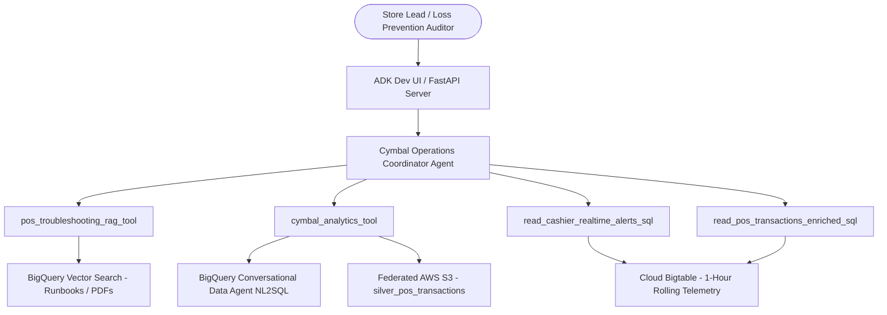

# Software Design Document (SDD): Cymbal Operations Agent

## 1. System Overview & Objectives
The **Cymbal Operations Coordinator Agent (`cymbal_operations_agent`)** is an enterprise AI assistant for store managers, regional leads, and loss-prevention auditors across Cymbal's retail network. It synthesizes unstructured runbooks, BigQuery operational data marts, low-latency Cloud Bigtable telemetry, and cross-cloud federated data into actionable operational insights.

---

## 2. Architecture & Component Topology

---

## 3. Tool Specifications & Data Contracts

### 3.1 `pos_troubleshooting_rag_tool`
- **Purpose:** Vector similarity retrieval over POS terminal hardware manuals (Toshiba TCx 810) and runbooks.
- **Contract:** Input `query: str` $\rightarrow$ Output markdown with certified recovery steps and GCS PDF links.
- **Confidence Threshold:** Enforces $\ge 0.70$ cosine similarity; returns standardized refusal on low confidence.

### 3.2 `cymbal_analytics_tool`
- **Purpose:** Natural Language to SQL analytics tool powered by BigQuery Conversational Data Agent.
- **Data Marts:**
  - `pos_transactions_gold`: Intraday POS transactions.
  - `pos_anomaly_alerts`: Cashier anomaly and promo abuse alerts.
  - `gold_inventory_reconciliation_ledger`: Inventory reconciliation & cover hours.
  - `warranty_generic_sections_extracted`: Warranty terms & conditions.
  - `silver_pos_transactions`: Federated AWS S3 transaction logs.

### 3.3 `read_cashier_realtime_alerts_sql` / `read_pos_transactions_enriched_sql`
- **Purpose:** Sub-second Cloud Bigtable declarative GoogleSQL queries for real-time 1-hour rolling metrics, risk scores, and masked POS checkouts.

---

## 4. Mandatory Safety & Operational Guardrails

1. **Date-Pruning & Timeframe Clarification:**
   - Unbounded queries on partitioned tables require an explicit prompt requesting date boundaries.
2. **PCI-DSS Payment Card Masking:**
   - Customer card data must strictly follow `XXXX-XXXX-XXXX-9999`.
3. **Temporal Invalidation:**
   - Real-time rolling 1-hour Bigtable metrics are transient and must not be cached across turns.

---

## 5. Multi-Dispatch Orchestration Protocols

- **Parallel Dispatch:** Concurrently query Bigtable (live 1-hour) and BigQuery (7-day baseline) for dual-baseline cashier risk evaluations.
- **Sequential Dispatch:** Turn 1 identifies top anomalous cashiers $\rightarrow$ Turn 2 retrieves detailed transaction logs across BigQuery/AWS S3.

---

## 6. Evaluation & Continuous Quality Flywheel
Evaluation assets reside in `tests/eval/`:
- `tests/eval/datasets/eval-data.json`: Core operational scenarios.
- `tests/eval/datasets/eval-data2.json`: Edge cases and guardrails.
- `tests/eval/eval_config.yaml`: LLM-as-judge and code metric configuration.
- `tests/eval/evaluation_report.md`: Benchmark documentation.
