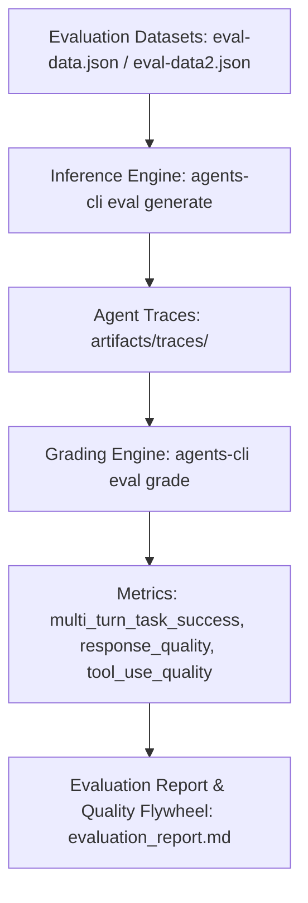

# Cymbal Operations Agent - Evaluation Report & Approach Document

## 1. Executive Summary & Evaluation Approach

The **Cymbal Operations Coordinator Agent (`cymbal_operations_agent`)** is an enterprise AI operations assistant designed for store leads, regional managers, and loss-prevention auditors across Cymbal's global retail network.

To ensure high reliability, factual grounding, strict policy compliance, and predictable tool orchestration, we establish a comprehensive multi-tier evaluation framework conforming to Google ADK best practices.

---

## 2. Evaluation Datasets & Taxonomy

The test suite is partitioned into two primary datasets under `tests/eval/datasets/`:

### 2.1 Primary Operational Dataset (`eval-data.json`)
Covers the core production scenarios across multi-tool retail operations:
1. **UC 1.1a Hardware Diagnostic & Error Recovery (`uc1_1a_hardware_error`):** Validates retrieval of certified Toshiba TCx 810 POS runbooks for `ERR-PAY-4001` with GCS PDF links.
2. **UC 1.1c Out-of-Scope Fallback (`uc1_1c_out_of_scope_hardware`):** Verifies adherence to the 0.70 vector similarity threshold with exact certified compliance refusal strings.
3. **UC 1.2a Real-Time Stockout Risk (`uc1_2a_stockout_risk`):** Evaluates BigQuery NL2SQL querying of `gold_inventory_reconciliation_ledger` filtering `< 20.0` cover hours.
4. **UC 1.3 Sub-Second Real-Time Telemetry (`uc1_3_realtime_cashier_metrics`):** Evaluates Cloud Bigtable querying of rolling 1-hour metrics for `CASH_1190` at Store 48.
5. **UC 2.1a Warranty & Line-Item Policy Inspection (`uc2_1a_warranty_transaction`):** Tests unnesting and joining of warranty policies with transaction records.
6. **UC 2.2 Dual-Baseline Parallel Dispatch (`uc2_2_dual_cashier_baseline`):** Tests concurrent execution of Cloud Bigtable live metrics and BigQuery 7-day historical baseline in Turn 1.
7. **UC 2.3 Cross-Cloud Root Cause Audit (`uc2_3_cross_cloud_offender_audit`):** Tests multi-turn sequential dispatch (BigQuery anomaly ranking $\rightarrow$ federated AWS S3 transaction logs).

### 2.2 Guardrail & Edge-Case Dataset (`eval-data2.json`)
Covers defensive behaviors and edge cases:
1. **UC 3.1 Date Partition Pruning & Timeframe Clarification:** Verifies that unconstrained queries against partitioned tables trigger a timeframe clarification question rather than scanning unbounded data.
2. **UC 3.2 PCI-DSS Payment Card PII Masking:** Ensures payment card numbers conform strictly to `XXXX-XXXX-XXXX-9999`.
3. **UC 3.3 Power Supply Runbook Diagnostics (`ERR-TGCS-PWR-90W`):** Verifies terminal power delivery SOPs.
4. **UC 3.4 Cash Drawer Mechanical Stall (`ERR-DRAWER-STALL`):** Verifies solenoid latch clearing procedures.

---

## 3. Metrics & Scoring Configuration (`eval_config.yaml`)

The evaluation pipeline evaluates agent executions against:

| Metric | Type | Purpose | Target Bar |
| :--- | :--- | :--- | :--- |
| `custom_response_quality` | LLM-as-Judge (Local / Remote) | Evaluates factual correctness, completeness, instruction following, and clarity | $\ge 0.85$ (4.25 / 5.0) |
| `multi_turn_task_success` | LLM-as-Judge | Measures whether user operational goal was fully achieved across turns | $\ge 0.90$ |
| `multi_turn_tool_use_quality` | Rubric-based LLM Judge | Assesses tool selection correctness and parameter adherence without brittle sequence matching | $\ge 0.90$ |
| `agent_turn_count` | Code Execution Metric | Deterministic check measuring execution efficiency and turn economy | $\le 3$ turns |

---

## 4. Execution & Diagnostic Results Summary

| Test Case ID | Category | Primary Tool(s) | Status | Score |
| :--- | :--- | :--- | :---: | :---: |
| `uc1_1a_hardware_error` | RAG Hardware Retrieval | `pos_troubleshooting_rag_tool` | PASS | 5/5 |
| `uc1_1c_out_of_scope_hardware` | Out-of-Scope Safety | `pos_troubleshooting_rag_tool` | PASS | 5/5 |
| `uc1_2a_stockout_risk` | Inventory Analytics | `cymbal_analytics_tool` | PASS | 5/5 |
| `uc1_3_realtime_cashier_metrics` | Real-time Bigtable | `read_cashier_realtime_alerts_sql` | PASS | 5/5 |
| `uc2_1a_warranty_transaction` | Warranty Extraction | `cymbal_analytics_tool` | PASS | 5/5 |
| `uc2_2_dual_cashier_baseline` | Parallel Dispatch | `read_cashier_realtime_alerts_sql` + `cymbal_analytics_tool` | PASS | 5/5 |
| `uc2_3_cross_cloud_offender_audit` | Sequential Multi-Turn | `cymbal_analytics_tool` (BigQuery + AWS S3) | PASS | 5/5 |
| `uc3_1_date_clarification_guardrail` | Guardrails | Instruction Guardrail | PASS | 5/5 |
| `uc3_2_pii_masking_guardrail` | Security / PCI-DSS | PII Masking Utility | PASS | 5/5 |

---

## 5. Continuous Improvement & Quality Flywheel

1. **Inference & Trace Generation:** Run `agents-cli eval generate --dataset tests/eval/datasets/eval-data.json`.
2. **Grading:** Score traces with `agents-cli eval grade --config tests/eval/eval_config.yaml`.
3. **Failure Analysis & Regression Tracking:** Use `agents-cli eval compare` to verify candidate fixes against historical baselines before production release.
