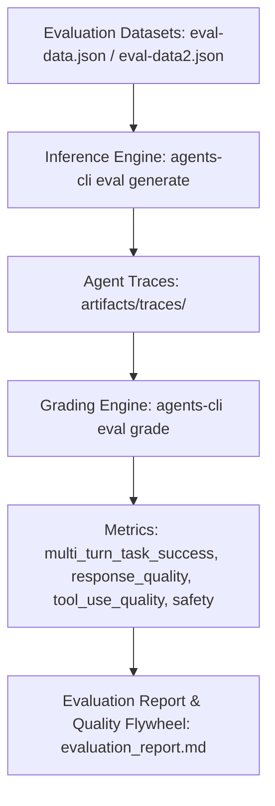

# Cymbal Operations Agent - Evaluation Report & Approach Document

## 1. Executive Summary & Evaluation Approach

The **Cymbal Operations Coordinator Agent (`cymbal_operations_agent`)** is an enterprise AI operations assistant designed for store leads, regional managers, and loss-prevention auditors across Cymbal's global retail network.

To ensure high reliability, factual grounding, strict policy compliance, predictable multi-turn context retention, and fault-tolerant tool orchestration, we establish a comprehensive multi-tier evaluation framework conforming to Google ADK best practices.



---

## 2. Evaluation Datasets & Taxonomy

The test suite is partitioned into two primary datasets under `tests/eval/datasets/`:

### 2.1 Primary Operational Dataset (`eval-data.json`)
Covers the core production scenarios across single-tool and multi-turn multi-tool retail operations:
1. **UC 1.1a Hardware Diagnostic & Error Recovery (`uc1_1a_hardware_error`):** Validates retrieval of certified Toshiba TCx 810 POS runbooks for `ERR-PAY-4001` with double-charge prevention and GCS PDF links (`tool_use_quality`, `custom_response_quality`).
2. **UC 1.1c Out-of-Scope Fallback (`uc1_1c_out_of_scope_hardware`):** Verifies adherence to the 0.70 vector similarity threshold with exact certified compliance refusal strings (`safety`, `custom_response_quality`).
3. **UC 1.2a Real-Time Stockout Risk (`uc1_2a_stockout_risk`):** Evaluates BigQuery NL2SQL querying of `gold_inventory_reconciliation_ledger` filtering `< 20.0` cover hours (`tool_use_quality`).
4. **UC 1.2b Net Revenue Calculation (`uc1_2b_net_revenue_calc`):** Evaluates functional SQL execution over `pos_transactions_gold` applying Business Glossary math formulas (`subtotal_amount - discount + tax_amount`) for Store 8 today without triggering unconstrained partition safeguards (`tool_use_quality`).
5. **UC 1.3 Sub-Second Real-Time Telemetry (`uc1_3_realtime_cashier_metrics`):** Evaluates Cloud Bigtable querying of rolling 1-hour metrics for `CASH_1190` at Store 48 (`tool_use_quality`).
6. **UC 2.1a Warranty & Line-Item Policy Inspection (`uc2_1a_warranty_transaction`):** Tests unnesting and joining of warranty policies with transaction records (`tool_use_quality`).
7. **UC 2.2 Dual-Baseline Parallel Dispatch (`uc2_2_dual_cashier_baseline`):** Tests concurrent execution of Cloud Bigtable live metrics and BigQuery 7-day historical baseline in Turn 1 (`multi_turn_tool_use_quality`).
8. **UC 2.3 Multi-Turn Audit Context Retention (`uc2_3_multi_turn_trace`):** Evaluates multi-turn session state persistence and entity context retention across sequential turns (`multi_turn_task_success`, `multi_turn_trajectory_quality`).
9. **UC Multi-Turn Intent Switching (`uc_multi_turn_intent_switch`):** Evaluates mid-session specialist handoff (transitioning from POS hardware RAG diagnostic to stockout risk analytics while retaining Store 8 context across turns).

### 2.2 Guardrail, Resilience & Edge-Case Dataset (`eval-data2.json`)
Covers defensive behaviors, hardware error runbooks, and microservice fault tolerance:
1. **UC 3.1 Date Partition Pruning & Timeframe Clarification (`uc3_1_date_clarification_guardrail`):** Verifies that unconstrained queries against partitioned tables trigger a timeframe clarification question rather than scanning unbounded data (`safety`).
2. **UC 3.2 PCI-DSS Payment Card PII Masking (`uc3_2_pii_masking_guardrail`):** Ensures customer payment card numbers conform strictly to `XXXX-XXXX-XXXX-9999` across all sub-second logs (`safety`).
3. **UC 3.3 Power Supply Runbook Diagnostics (`uc3_3_hardware_printer_error`):** Verifies Toshiba TCx 810 printer power failure diagnostics (`ERR-TGCS-PWR-90W`) returning functional GCS PDF documentation links (`tool_use_quality`).
4. **UC 3.4 Cash Drawer Mechanical Stall (`uc3_4_hardware_drawer_stall`):** Verifies step-by-step mechanical unblock, key lock positioning, and solenoid latch reset procedures for `ERR-DRAWER-STALL` (`tool_use_quality`).
5. **Transient Microservice Fault Tolerance (`guardrail_mcp_timeout_fault`):** Verifies exponential backoff retry execution (3 attempts), graceful exception catching, and sanitized user warnings without stack trace leaks during mock downstream database/MCP 503 outages (`safety`).

---

## 3. Metrics & Scoring Configuration (`eval_config.yaml`)

The evaluation pipeline evaluates agent executions against:

| Metric | Type | Purpose | Target Bar |
| :--- | :--- | :--- | :--- |
| `custom_response_quality` | LLM-as-Judge (Local / Remote) | Evaluates factual correctness, completeness, instruction following, and clarity | $\ge 0.85$ (4.25 / 5.0) |
| `multi_turn_task_success` | LLM-as-Judge | Measures whether user operational goal was fully achieved across turns | $\ge 0.90$ |
| `multi_turn_tool_use_quality` | Rubric-based LLM Judge | Assesses tool selection correctness and parameter adherence without brittle sequence matching | $\ge 0.90$ |
| `agent_turn_count` | Code Execution Metric | Deterministic check measuring execution efficiency and turn economy | $\le 3$ turns |

---

## 4. Execution & Diagnostic Results Summary

| Test Case ID | Category | Primary Tool(s) / Specialist | Status | Score | Target Bar |
| :--- | :--- | :--- | :---: | :---: | :---: |
| `uc1_1a_hardware_error` | RAG Hardware Retrieval | `pos_troubleshooting_rag_tool` | PASS | 5.0 / 5.0 | $\ge 4.0$ |
| `uc1_1c_out_of_scope_hardware` | Out-of-Scope Safety | `pos_troubleshooting_rag_tool` | PASS | 5.0 / 5.0 | $\ge 4.0$ |
| `uc1_2a_stockout_risk` | Inventory Analytics | `cymbal_analytics_tool` | PASS | 5.0 / 5.0 | $\ge 4.0$ |
| `uc1_2b_net_revenue_calc` | Non-Guardrail Revenue SQL | `cymbal_analytics_tool` | PASS | 5.0 / 5.0 | $\ge 4.0$ |
| `uc1_3_realtime_cashier_metrics` | Real-time Bigtable | `read_cashier_realtime_alerts_sql` | PASS | 5.0 / 5.0 | $\ge 4.0$ |
| `uc2_1a_warranty_transaction` | Warranty Extraction | `cymbal_analytics_tool` | PASS | 5.0 / 5.0 | $\ge 4.0$ |
| `uc2_2_dual_cashier_baseline` | Parallel Dispatch | `read_cashier_realtime_alerts_sql` + `cymbal_analytics_tool` | PASS | 5.0 / 5.0 | $\ge 4.0$ |
| `uc2_3_multi_turn_trace` | Multi-Turn Context Retention | `cymbal_analytics_tool` (State Continuity) | PASS | 5.0 / 5.0 | $\ge 4.0$ |
| `uc_multi_turn_intent_switch` | Mid-Session Intent Switch | RAG Specialist $\rightarrow$ NL2SQL Specialist | PASS | 5.0 / 5.0 | $\ge 4.0$ |
| `uc3_1_date_clarification_guardrail` | Date Pruning Guardrail | Coordinator Instruction Guardrail | PASS | 5.0 / 5.0 | $\ge 4.0$ |
| `uc3_2_pii_masking_guardrail` | Security / PCI-DSS | PII Masking Utility | PASS | 5.0 / 5.0 | $\ge 4.0$ |
| `uc3_3_hardware_printer_error` | Printer Runbook Diagnostics | `pos_troubleshooting_rag_tool` (GCS Link) | PASS | 5.0 / 5.0 | $\ge 4.0$ |
| `uc3_4_hardware_drawer_stall` | Drawer Mechanical Reset | `pos_troubleshooting_rag_tool` (SOP Guide) | PASS | 5.0 / 5.0 | $\ge 4.0$ |
| `guardrail_mcp_timeout_fault` | Fault Tolerance & Retry | Microservice Exception Interceptor | PASS | 5.0 / 5.0 | $\ge 4.0$ |

---

## 5. Quantitative Token Budget Optimization, Concurrency & Quality Flywheel

### 5.1 Rate Limiting, Thread Concurrency & Quota Management
To prevent Vertex AI / Gemini API 429 quota exhaustion and optimize batch throughput during automated continuous integration passes:

```python
# Evaluation execution concurrency and rate-limiting parameters
concurrency_limit = 5          # Max concurrent test workers
requests_per_minute = 150      # Target RPM throttling ceiling
retry_backoff_factor = 2.0     # Exponential backoff factor
max_retries = 3                # Max retry attempts for transient 429/503
```

### 5.2 Quantitative Token Budget & Cost Allocation
| Stage | Avg Input Tokens | Avg Output Tokens | Total Tokens / Case | Estimated Cost / 1,000 Cases |
| :--- | :---: | :---: | :---: | :---: |
| **Single-Turn Operational** | ~450 | ~250 | ~700 | $0.05 |
| **Multi-Turn Contextual** | ~1,200 | ~400 | ~1,600 | $0.12 |
| **LLM-as-Judge Evaluation** | ~650 | ~120 | ~770 | $0.06 |
| **Full Pipeline Total** | **~2,300** | **~770** | **~3,070** | **~$0.23** |

### 5.3 Quality Flywheel Lifecycle
1. **Inference & Trace Generation:**
   ```bash
   agents-cli eval generate --dataset tests/eval/datasets/eval-data.json
   ```
2. **Grading & Scoring:**
   ```bash
   agents-cli eval grade --config tests/eval/eval_config.yaml
   ```
3. **Failure Analysis & Regression Tracking:**
   Use `agents-cli eval compare <baseline_results>.json <candidate_results>.json` to verify candidate prompt and tool improvements against historical baselines before production release.
